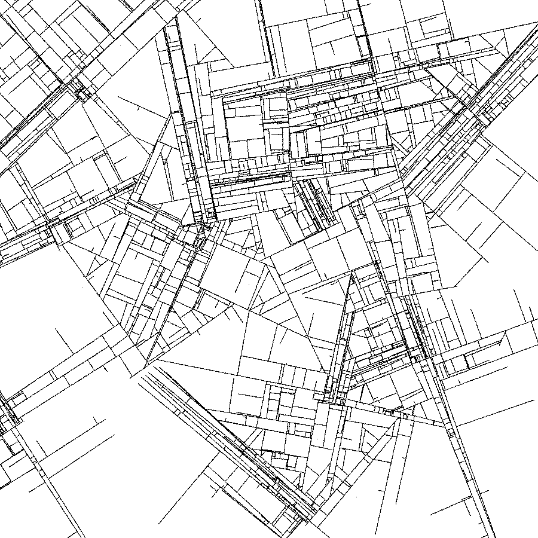

# Substrate

A port to immutable and functional F# from the original Java implementation by j.tarbell (<http://www.complexification.net/gallery/machines/substrate/)>

    

This specific implementation is a port of the code found here, more or less: <http://www.complexification.net/gallery/machines/substrate/appletl/substrate_l.pde>

Changes from the source include:

- Obviously, its in F# and makes use of immutability, purity and all the pipelining/match goodness to be much more concise than the original java
- I haven't implemented the colouring, the 'sand painter' effect. Just because I don't really like the colours they had, but I might add this at a later date

~~## System.Drawing.Common~~

~~The output of this code, defined in Program.fs, makes use of System.Drawing.Common to compose a png. This works fine in windows, as it uses native GDI+. On Linux and Mac you will need to install 'libgdiplus' to get this working.~~

## Update - MonoGame integration

Using my wrapped monogame core loop **fsharp-gamecore**, this project now draws in real time. If you want a bitmap, feel free to walk back prior to this change in the commit history.

## Core RT

Because the core algorithm is quite slow (average 30 seconds on my i7), I have added CoreRT. If you run `dotnet publish -r win-x64` or `linux-x64` or `osx-x64` and have the right requirements for CoreRT (things like C++ Build tools on windows, or clang and supporting libs on linux) it will output an executable that is MUCH faster (i.e. 10x).